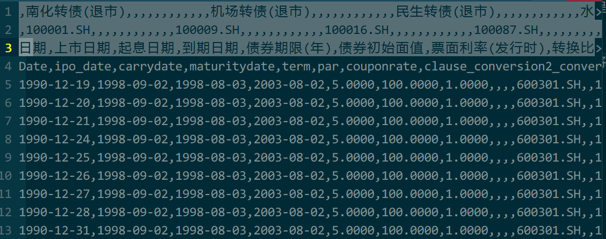
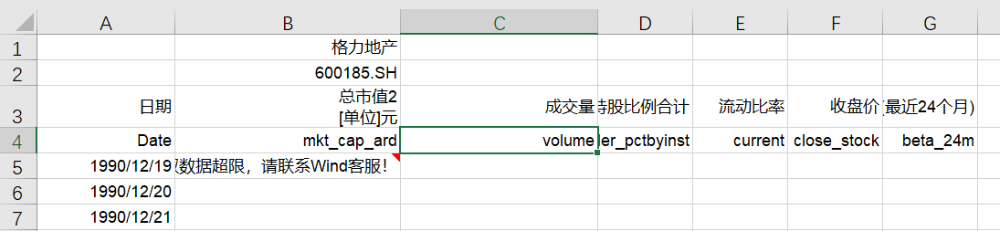
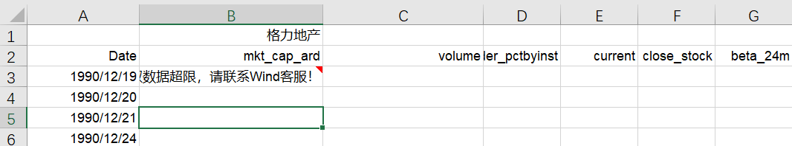

# bond数据分离spliDataBond.py

- 修改程序中`BOND_FILE`为需要分离的bond数据文件路径
- 修改程序中`SPLIT_DIR`为分离的数据保存路径
- 分离之后的数据保存在`SPLIT_DIR`中，每一个可转债的

  数据存放在不同的子目录中的`bond.csv`文件中。

## Note

原始文件如下，不需要修改

# stock数据分离splitDataStock.py

使用和`splitDataBond.py`一样。

在从excel导出csv的时候，需要将表中的第二行和第三行删掉，
然后再到处csv。

原始文件如下

将第二行和第三行删掉之后

# 批量套利计算batchComputation.py

# 批量过滤bond数据中的空白数据batchFilter.py

## Note

需要将公司名字中作为文件名的非法字符去除。

如`*ST柳化`需要去掉名字中的`*`，改成`ST柳化`。

# License

